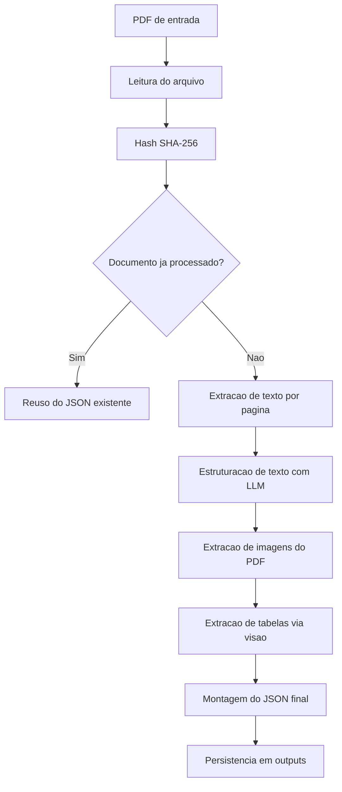

# SML_T1 - Conversao de PDF em JSON Estruturado

O objetivo principal deste projeto e transformar um PDF em dado estruturado (JSON), pronto para consumo por APIs, dashboards, ETL ou analise automatizada.

Em vez de retornar texto bruto, o pipeline organiza o conteudo em estruturas com semantica:

- metadados do documento
- extracao textual estruturada por pagina
- tabelas detectadas em imagens (visao)


A conversao acontece em duas trilhas complementares:

1. Texto do PDF -> JSON estruturado por pagina
2. Imagens com tabelas -> JSON de tabelas

No final, as duas trilhas sao unificadas em um unico arquivo JSON em `outputs/<file_id>.json`.

## Pipeline de Transformacao



## Estrutura do JSON Final

O JSON final e desenhado para representar o documento processado, nao apenas copiar seu conteudo bruto.

```json
{
    "file_id": "uuid",
    "document_hash": "sha256",
    "source_file": "/caminho/absoluto/do/pdf",
    "text_extraction": [
        {
            "page": 1,
            "structured_text": {
                "titulo": "...",
                "data_referencia": "...",
                "fonte": "...",
                "destaques": {},
                "secoes": [
                    {
                        "titulo": "...",
                        "paragrafos": ["..."],
                        "indicadores": {}
                    }
                ]
            },
            "llm_error": null
        }
    ],
    "table_from_image_extraction": [
        {
            "table_name": "...",
            "data": [],
            "totals": {},
            "source": ["..."],
            "confidence": 0.98
        }
    ]
}
```

## Como a Transformacao e Feita no Codigo

## 1) Orquestracao do processo

Em `app.py`, a funcao `process_pdf` controla o fluxo inteiro: leitura, extracao, estruturacao e escrita do JSON final.

```python
texts = extract_text(pdf_path)
tables = extract_tables(pdf_path)
images = extract_images(pdf_path, file_id)
image_tables = extract_tables_from_images(images)

result = {
        "file_id": file_id,
        "document_hash": document_hash,
        "source_file": os.path.abspath(pdf_path),
        "text_extraction": texts,
        "table_from_image_extraction": image_tables,
}
```

Observacao: `extract_tables(pdf_path)` pode ser mantido para uso interno/diagnostico, mas nao e persistido no JSON final.

## 2) Texto bruto -> JSON semantico

Em `extractors/text_extractor.py`, cada pagina e lida com PyMuPDF e enviada ao modelo textual com um prompt de normalizacao.

```python
input_payload = {
        "page": page_index + 1,
        "text": text.strip()
}

final_prompt = prompt.replace(
        "{{TEXT_EXTRACTION_JSON}}",
        json.dumps(input_payload, ensure_ascii=False)
)

llm_response = ask_gpt_text(final_prompt)
structured_text = json.loads(llm_response)
```

Resultado dessa etapa:

- remove ruido do OCR/texto extraido
- agrupa conteudo por secoes
- transforma indicadores em chave-valor

## 3) Tabelas em imagens -> JSON tabular

Em `extractors/image_extractor.py`, as imagens de cada pagina sao extraidas.
Em `extractors/vision_extractor.py`, cada imagem e analisada pelo modelo de visao para retornar JSON de tabelas.

```python
response = _ask_gpt_vision_with_loading(...)
parsed_response = json.loads(response)

if parsed_response.get("has_table") is False:
        continue

result.append(parsed_response)
```

Resultado dessa etapa:

- tabelas viram arrays/objetos JSON
- itens sem tabela sao descartados
- `table_from_image_extraction` fica focado apenas em dado tabular

## 4) Robustez da conversao (429 / rate limit)

Em `services/gpt_service.py`, as chamadas a OpenAI possuem retry com backoff para reduzir falhas em lotes maiores.

```python
if is_rate_limit and attempt < OPENAI_MAX_RETRIES:
        delay_seconds = _compute_retry_delay_seconds(exc, error_body, attempt)
        time.sleep(delay_seconds)
        continue
```

## Deduplicacao de Documento

Antes de converter, o arquivo recebe hash SHA-256.
Se o hash ja existir em `outputs/processed_index.json`, o projeto reaproveita o JSON pronto.

Isso evita custo duplicado e acelera reprocessamentos.

## Como Executar

## 1) Ambiente

```bash
python3 -m venv venv
source venv/bin/activate
pip install pymupdf pdfplumber requests
```

## 2) `.env` minimo

```env
OPENAI_API_KEY=<sua_chave>
OPENAI_MODEL=gpt-4o-mini
OPENAI_VISION_MODEL=gpt-4o-mini
PDF_PATH=PDF/dados.pdf
ENABLE_VISION_EXTRACTION=true
```

## 3) Executar

```bash
python3 app.py
```

Saida: JSON estruturado em `outputs/<file_id>.json`.

## Ponto Central para Evolucao do Projeto

Se o foco e melhorar a qualidade da conversao PDF -> JSON, os principais pontos de ajuste sao:

1. Prompt de texto em `extractors/text_extractor.py` (qualidade semantica)
2. Prompt de visao em `extractors/vision_extractor.py` (fidelidade de tabelas)
4. Parametros de resiliencia em `services/gpt_service.py` (estabilidade em producao)
